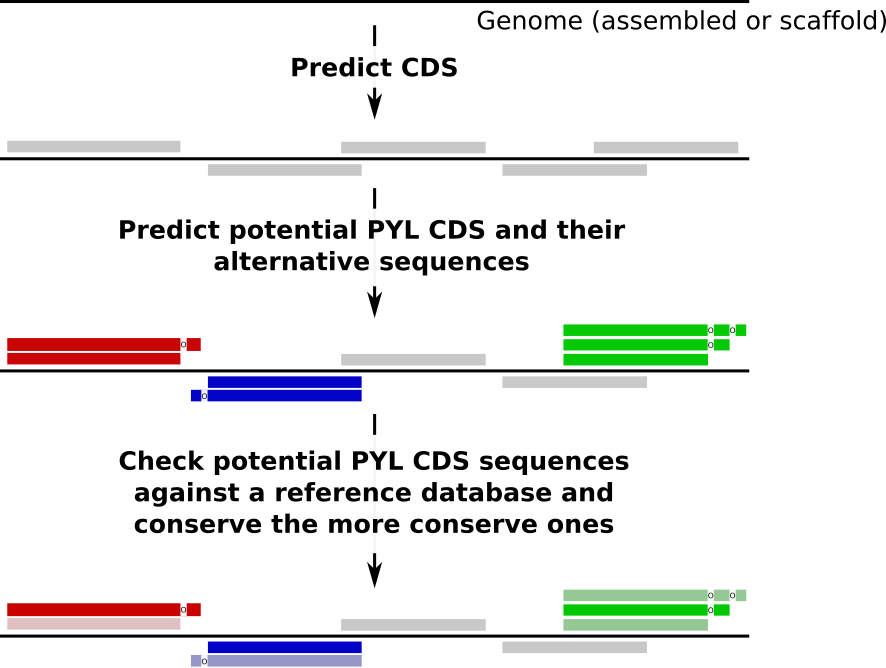

Identification of potential PYL proteins
========================================

PylProtPredictor identifies proteins potentially using Pyrrolysine as amino acid in any genome, given the following workflow:

.. _main_workflow:

Prediction
----------

The first step of the workflow is the prediction of proteins potentially using Pyrrolysine (PYL) as amino acid. In these proteins, the TAG codon is not used as a STOP codon but translated into PYL amino acid.

This prediction starts with the prediction of the CDS on a genome using `Prodigal <>`_. The TAG-ending CDS are then identified: their sequence is extracted and potentially extended until next STOP codon to extract potential alternative sequences for these proteins with PYL as amino acid.

.. _prediction_workflow:

.. figure:: img/prediction_scheme.png
   :scale: 50 %
   :align: center

Checking
--------

For each TAG-ending CDS, several potential sequences are extracted: the original identified CDS and possible extensions in which TAG would not be a STOP codon but a PYL.

To identify which sequence for each CDS is the most likely, the sequences are searched against a reference database (`UniRef 90 <>`_). The sequence with the smallest evalue in the similarity search is conserved as the representative sequence for the CDS.